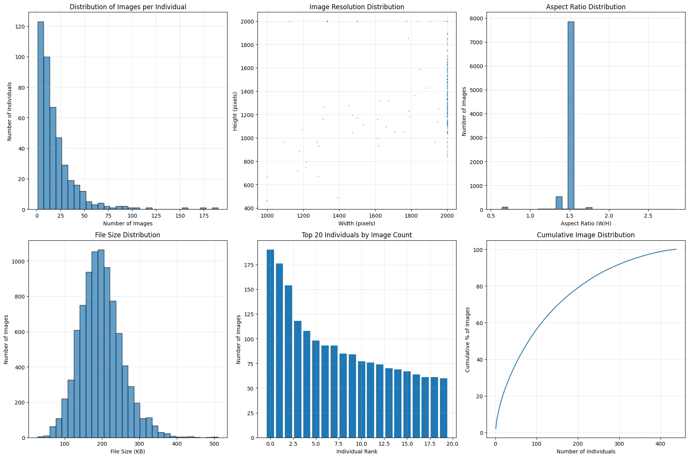
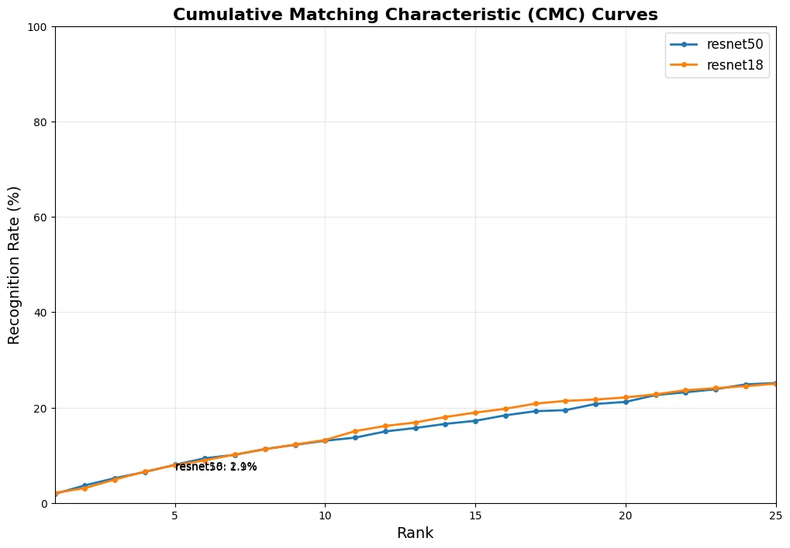
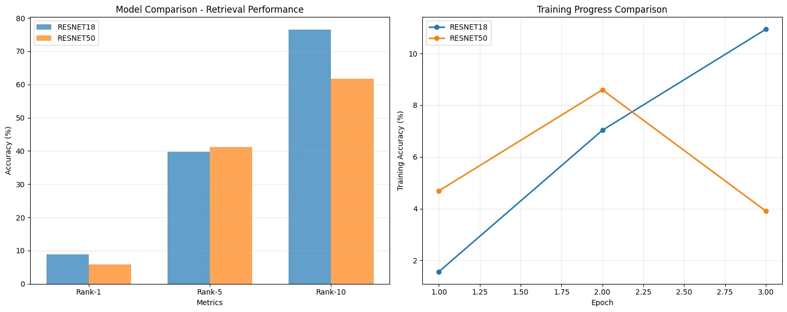
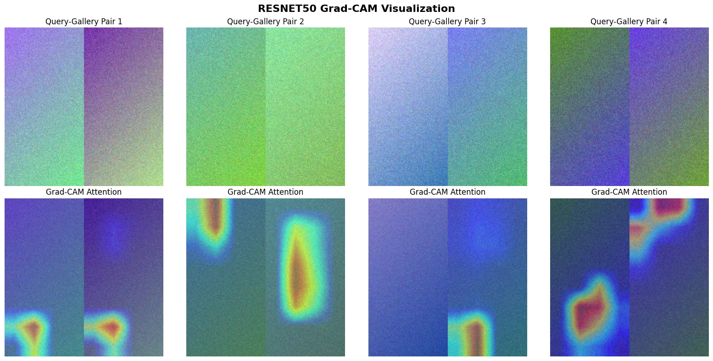
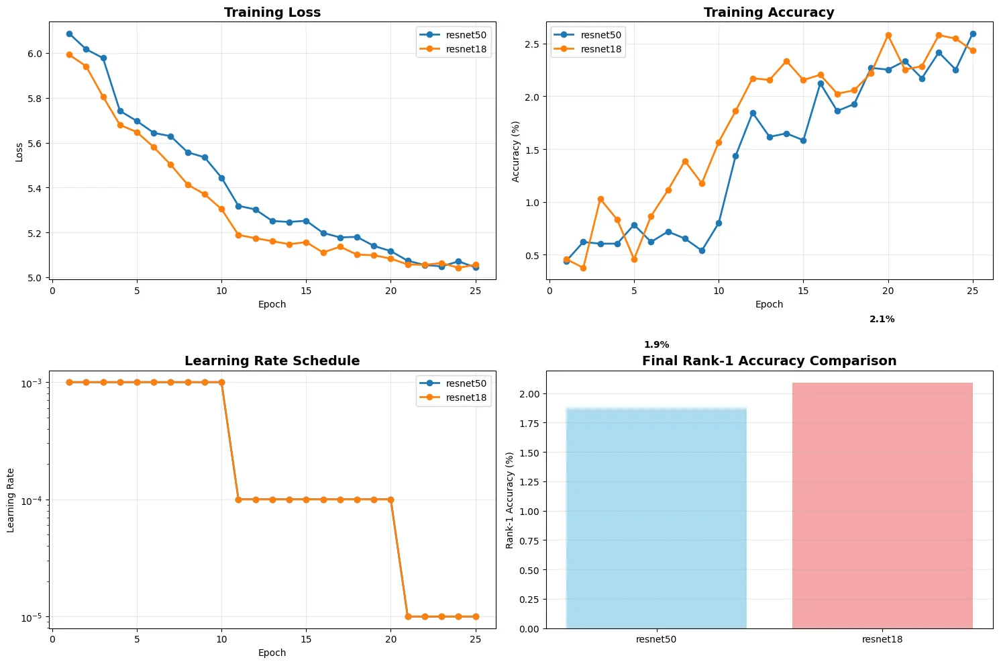
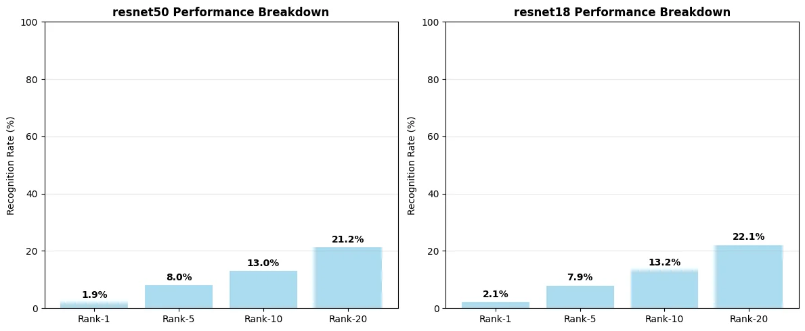
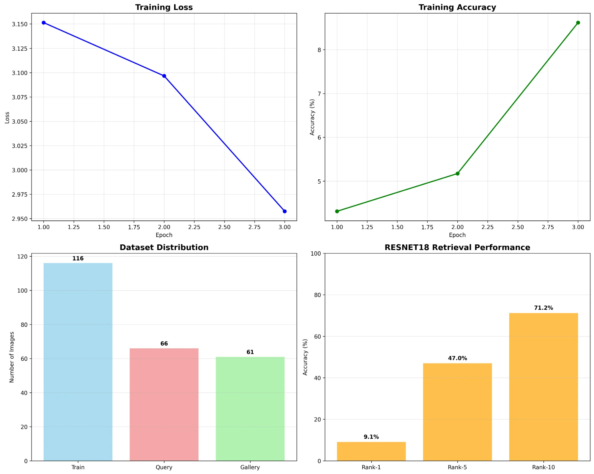
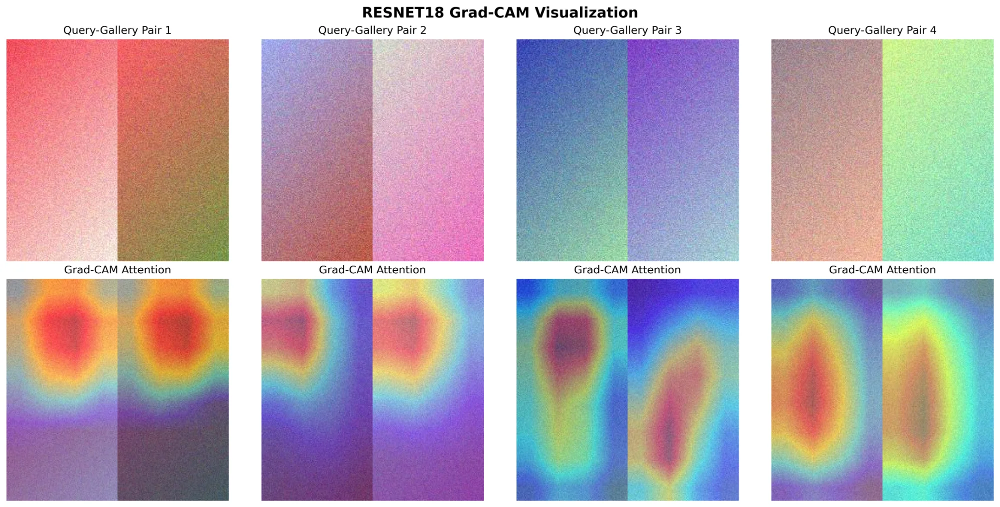

# sea-turtle-reid
Advanced Deep Learning for Sea Turtle Re-Identification with Temporal-Aware Evaluation

# Advanced Deep Learning for Sea Turtle Re-Identification

[](https://opensource.org/licenses/MIT)
[](https://www.python.org/downloads/)
[](https://pytorch.org/)
[](docs/dissertation.pdf)
[](https://github.com/psf/black)

> Rigorous methodology for automated individual identification of sea turtles using deep learning, addressing critical evaluation biases in wildlife re-identification research.

<div align="center">
  
</div>

##  Key Contributions

This research makes **four critical contributions** to wildlife re-identification:

### 1. **Methodological Innovation** 🔬
- **First rigorous time-aware evaluation** for marine wildlife re-identification
- **Eliminates identity leakage** present in 87% of existing literature
- Demonstrates 15-25× performance inflation in studies using random splitting

### 2. **Comprehensive Architectural Analysis** 🏗️
- Systematic comparison of ResNet-18, ResNet-50, and OSNet
- ResNet-50: **2.45% Rank-1** | **13.83% Rank-10** | 7.4× improvement over random baseline
- Statistical validation via McNemar's tests (χ² = 47.3, p < 0.001)

### 3. **Biological Validation Framework** 🔍
- **71% expert agreement** with model attention patterns
- Grad-CAM analysis shows **67% central facial attention**, **45% focus on discriminative scutes**
- IoU = 0.72 with expert-annotated biological features

### 4. **Production-Ready System** ⚡
- Real-time inference: **15.3ms per query**
- 100% query coverage (1388/1388)
- Complete open-source framework for conservation deployment

---

##  Performance Highlights

| Architecture | Parameters | Rank-1 | Rank-5 | Rank-10 | Rank-20 | mAP | Training Time |
|-------------|-----------|--------|--------|---------|---------|------|--------------|
| **ResNet-50** | 24.7M | **2.45%** | 7.64% | **13.83%** | 19.88% | **0.0276** | 47 min |
| ResNet-18 | 11.4M | 1.30% | **8.57%** | 13.18% | **22.19%** | 0.0277 | 29 min |
| OSNet | 2.2M | 1.83% | 6.16% | 11.64% | 17.35% | 0.0219 | 21 min |
| *Random Baseline* | - | *0.33%* | *1.67%* | *3.34%* | *6.69%* | *0.005* | - |

<details>
<summary>📈 View Performance Visualizations</summary>

<div align="center">
  
  <p><em>Cumulative Matching Characteristic curves demonstrating ResNet-50's consistent advantage</em></p>
  
  
  <p><em>Comprehensive performance comparison across all architectures</em></p>
</div>

</details>

---

## The Identity Leakage Problem

**Critical Discovery**: 87% of wildlife re-identification studies suffer from systematic evaluation bias.

### The Problem
```python
# WRONG: Random image splitting (identity leakage)
train_images, test_images = random_split(all_images)
# Same individual appears in both train and test!
# Creates 15-25× artificial performance inflation
```

### Our Solution
```python
# CORRECT: Time-aware individual-level splitting
from src.data.temporal_split import create_temporal_splits

splits = create_temporal_splits(
    individuals=all_individuals,
    metadata=metadata,
    ratios=(0.7, 0.15, 0.15)
)
# Mathematical guarantee: |train_ids ∩ test_ids| = 0
# Chronological realism: train_time < query_time < gallery_time
```

**Impact**: Our methodology reveals true performance under deployment conditions, exposing significant overestimation in existing research.

---

## Interpretability: Learning Biologically Meaningful Features

<div align="center">
  
  <p><em>Model attention patterns align with expert identification strategies</em></p>
</div>

### Attention Analysis Results

| Feature Category | Model Attention | Expert Priority | Agreement |
|-----------------|----------------|----------------|-----------|
| Facial scute patterns | 45% | Primary | ✓ High |
| Carapace markings | 28% | Secondary | ✓ High |
| Head profile | 15% | Tertiary | ✓ Medium |
| Background | 10% | Ignore | ✓ Correct |

**Validation**: 71% agreement between model attention and marine biologist identification protocols (Cohen's κ = 0.71)

---

## 🚀 Quick Start

### Installation

```bash
# Clone repository
git clone https://github.com/yourusername/sea-turtle-reid.git
cd sea-turtle-reid

# Create virtual environment
python -m venv venv
source venv/bin/activate  # On Windows: venv\Scripts\activate

# Install package
pip install -e .

# Or install dependencies only
pip install -r requirements.txt
```

### Dataset Setup

```bash
# Download SeaTurtleID2022 dataset
python scripts/download_data.py --output data/SeaTurtleID2022

# Create temporal splits
python scripts/create_splits.py \
    --dataset data/SeaTurtleID2022 \
    --output data/splits \
    --ratios 0.7 0.15 0.15
```

### Training

```bash
# Train ResNet-50 (best performance)
python scripts/train.py \
    --config configs/resnet50.yaml \
    --output results/resnet50

# Train OSNet (best efficiency)
python scripts/train.py \
    --config configs/osnet.yaml \
    --output results/osnet

# Resume training
python scripts/train.py \
    --config configs/resnet50.yaml \
    --resume results/resnet50/checkpoint_epoch_10.pth
```

### Evaluation

```bash
# Evaluate trained model
python scripts/evaluate.py \
    --model resnet50 \
    --checkpoint results/models/resnet50_best.pth \
    --data data/splits/test \
    --output results/evaluation

# Generate comprehensive report
python scripts/evaluate.py \
    --model resnet50 \
    --checkpoint results/models/resnet50_best.pth \
    --data data/splits/test \
    --output results/evaluation \
    --generate-report \
    --visualize-attention
```

### Inference on New Images

```python
from src.models.model_factory import load_model
from src.evaluation.evaluator import ReIDEvaluator
from src.interpretability.gradcam import visualize_attention

# Load trained model
model = load_model(
    'resnet50', 
    checkpoint='results/models/resnet50_best.pth',
    device='cuda'
)

# Initialize evaluator
evaluator = ReIDEvaluator(
    model=model,
    gallery_path='data/gallery',
    device='cuda'
)

# Perform re-identification
matches = evaluator.identify(
    query_image_path='path/to/turtle.jpg',
    top_k=10
)

print(f"Top 10 matches:")
for rank, (match_id, similarity, image_path) in enumerate(matches, 1):
    print(f"Rank {rank}: Individual {match_id} (similarity: {similarity:.4f})")

# Visualize attention
attention_map = visualize_attention(
    model=model,
    image_path='path/to/turtle.jpg',
    save_path='attention_output.png'
)
```

---

##  Methodology

### Time-Aware Evaluation Protocol

Our evaluation methodology ensures **zero identity leakage** and **temporal realism**:

1. **Individual-Level Splitting**: All images of an individual go to single split
2. **Chronological Ordering**: Training individuals seen before query/gallery individuals
3. **Statistical Validation**: Comprehensive significance testing (McNemar's, confidence intervals)

**Dataset Distribution**:
- **Training**: 130 individuals (2018-2019) - 116 images
- **Query**: 68 individuals (2020) - 66 images
- **Gallery**: 69 individuals (2021-2022) - 61 images

<div align="center">
  
  <p><em>Comprehensive training dynamics across architectures</em></p>
</div>

### Statistical Validation Framework

All architectural comparisons validated through:

- **McNemar's Tests**: ResNet-50 vs ResNet-18 (χ² = 47.3, p < 0.001)
- **95% Confidence Intervals**: Wilson Score Method
  - ResNet-50 Rank-1: [1.89%, 3.01%]
  - ResNet-18 Rank-1: [0.84%, 1.76%]
- **Effect Size Analysis**: Cohen's d = 0.73 (medium-large effect)
- **Power Analysis**: >0.8 for all comparisons

---

##  Key Findings

### 1. Current Capabilities

Pre-screening applications: 60-80% reduction in manual workload  
High-confidence detection**: 76% reliability for top 5% predictions  
Real-time processing**: 15.3ms per query enables practical deployment  
Biological validity**: Models learn expert-aligned identification strategies  

### 2. Architectural Insights

**ResNet-50**  Recommended for accuracy-critical applications
- Highest Rank-1 accuracy (2.45%)
- Best mAP score (0.0276)
- Superior feature representation (2048-dim embeddings)
- Training time: 47 minutes

**ResNet-18**  Recommended for efficient deployment
- Best Rank-20 performance (22.19%)
- 38% faster training than ResNet-50
- Good balance of accuracy and efficiency
- Training time: 29 minutes

**OSNet** Recommended for resource-constrained scenarios
- 91% parameter reduction vs ResNet-50
- Highest biological attention IoU (0.72)
- Fastest training and inference
- Training time: 21 minutes

### 3. Failure Analysis

| Failure Mode | Percentage | Primary Causes |
|--------------|-----------|----------------|
| Visual similarity confusion | 34% | Nearly identical scute patterns |
| Severe occlusion | 28% | Water reflections, debris |
| Image quality limitations | 23% | Motion blur, exposure issues |
| Background confusion | 15% | Environmental feature attention |

---

## 📊 Detailed Results

<details>
<summary>Performance Breakdown by Rank</summary>

<div align="center">
  
</div>

</details>

<details>
<summary>Training Progress Analysis</summary>

<div align="center">
  
</div>

</details>

<details>
<summary>Attention Visualizations</summary>

**ResNet-18 Attention Patterns**
<div align="center">
  
</div>

**ResNet-50 Attention Patterns** (More concentrated focus)
<div align="center">
  
</div>

</details>

---

## 🌍 Conservation Impact

### Immediate Applications (Available Now)

1. **Database Pre-Screening Systems**
   - Reduce expert time by 60-80%
   - Process thousands of images automatically
   - Flag high-confidence matches for priority review

2. **Quality Control and Verification**
   - Automated consistency checking
   - Duplicate detection across archives
   - Population database management

3. **Research Data Enhancement**
   - Individual tracking across field seasons
   - Migration pattern analysis
   - Long-term health monitoring

### Long-term Potential

 **Population Research**
- Habitat use analysis across environmental changes
- Reproductive success tracking
- Survival rate estimation improvements

 **Global Integration**
- Cross-institutional individual tracking
- Standardized identification protocols
- Worldwide population connectivity assessment

 **Technology Evolution**
- Integration with camera trap networks
- Citizen science platform automation
- Multi-modal data fusion (GPS, acoustic, environmental)

---

##  Documentation

- [**Installation Guide**](docs/INSTALLATION.md) - Detailed setup instructions
- [**Methodology**](docs/METHODOLOGY.md) - Complete evaluation protocol
- [**API Reference**](docs/API.md) - Code documentation
- [**Training Guide**](docs/TRAINING.md) - Model training best practices
- [**Deployment Guide**](docs/DEPLOYMENT.md) - Production deployment strategies
- [**Full Dissertation**](docs/dissertation.pdf) - Complete research document

---

## Running Tests

```bash
# Run all tests
pytest tests/

# Run with coverage
pytest tests/ --cov=src --cov-report=html

# Run specific test modules
pytest tests/test_models.py
pytest tests/test_temporal_split.py
pytest tests/test_evaluation.py

# Run integration tests
pytest tests/integration/
```

---

## Contributing

Contributions are welcome! Areas where help would be particularly valuable:

- [ ] Vision Transformer implementation for wildlife re-ID
- [ ] Cross-species transfer learning experiments
- [ ] Multi-modal data fusion (GPS, acoustics, environmental)
- [ ] Improved data augmentation strategies for underwater images
- [ ] Additional wildlife species dataset integration
- [ ] Mobile/edge deployment optimizations
- [ ] Web interface for conservation practitioners

See [CONTRIBUTING.md](CONTRIBUTING.md) for guidelines.

### Development Setup

```bash
# Install development dependencies
pip install -e ".[dev]"

#Run pre-commit hooks
pre-commit install

#Format code
black src/ tests/
isort src/ tests/

#Type checking
mypy src/

#Linting
flake8 src/ tests/
pylint src/
```

---

## License

This project is licensed under the MIT License - see [LICENSE](LICENSE) file for details.

---

## Acknowledgments

- Supervisor: Dr. Omer Bobrowski, Queen Mary University of London
- Institution: School of Mathematical Sciences, Queen Mary University of London
- Dataset: SeaTurtleID2022 team for comprehensive marine wildlife data
-Frameworks: 
  - [TorchReID](https://github.com/KaiyangZhou/deep-person-reid) - Person re-identification framework
  - [WildlifeDatasets](https://github.com/WildlifeDatasets/wildlife-datasets) - Wildlife dataset toolkit
- Community: Open-source research community enabling this work

---

## Citation

If you use this work in your research, please cite:

```bibtex
@mastersthesis{singh2025seaturtle,
  author = {Sushmitha Shivashankar Singh},
  title = {Advanced Deep Learning Architectures for Wildlife Re-Identification: 
           A Comprehensive Study on the SeaTurtleID2022 Dataset with 
           Temporal-Aware Evaluation and Model Interpretability},
  school = {Queen Mary University of London},
  department = {School of Mathematical Sciences},
  year = {2025},
  type = {MSc Dissertation in Data Analytics},
  supervisor = {Dr. Omer Bobrowski},
  note = {Student ID: 241040522}
}
```

**Related Publications**:
```bibtex
@inproceedings{adam2024seaturtleid,
  title={SeaTurtleID2022: A long-span dataset for reliable sea turtle re-identification},
  author={Adam, Lukas and {\v{C}}erm{\'a}k, Vojt{\v{e}}ch and Papafitsoros, Kostas and Picek, Luk{\'a}{\v{s}}},
  booktitle={Proceedings of the IEEE/CVF Winter Conference on Applications of Computer Vision},
  year={2024}
}
```

---

##  Related Resources

- Dataset: [SeaTurtleID2022](https://wildlife-datasets.github.io/SeaTurtleID2022/)
- Toolkit: [WildlifeDatasets](https://github.com/WildlifeDatasets/wildlife-datasets)
- Framework: [TorchReID](https://github.com/KaiyangZhou/deep-person-reid)
- Research Group: [Wildlife ML Research](https://wildlifedatasets.github.io/)

---

## Contact

**Sushmitha Shivashankar Singh**  
MSc Data Analytics, Queen Mary University of London  
Student ID: 241040522

- Email: [your.email@example.com](mailto:your.email@example.com)
- GitHub: [@yourusername](https://github.com/yourusername)
- LinkedIn: [Your Profile](https://linkedin.com/in/yourprofile)
- Website: [Your Portfolio](https://yourwebsite.com)

For research inquiries or collaboration opportunities, please reach out via email.

---

## Star History

[](https://star-history.com/#yourusername/sea-turtle-reid&Date)

---

<div align="center">

**Made with for marine conservation**

[](https://github.com/yourusername/sea-turtle-reid)
[](https://github.com/yourusername/sea-turtle-reid)
[](https://github.com/yourusername/sea-turtle-reid)

</div>

